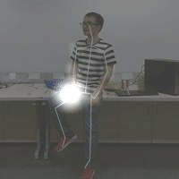
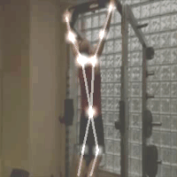

# ST-GCN

## Introduction
This repository holds the codebase, dataset and models for the paper:

**Spatial Temporal Graph Convolutional Networks for Skeleton-Based Action Recognition** Sijie Yan, Yuanjun Xiong and Dahua Lin, AAAI 2018. [[Arxiv Preprint]](https://arxiv.org/abs/1801.07455)

<div align="center">
    
</div>

## Visulization of ST-GCN in Action
Our demo for skeleton-based action recognition:
<p align="center">
    
</p>


ST-GCN is able to exploit local pattern and correlation from human skeletons.
Below figures show the neural response magnitude of each node in the last layer of our ST-GCN. 


<table style="width:100%; table-layout:fixed;">
  <tr>
    <td></td>
    <td></td>
    <td></td>
    <td></td>
    <td></td>
  </tr>
  <tr>
    <td><font size="1">Touch head<font></td>
    <td><font size="1">Sitting down<font></td>
    <td><font size="1">Take off a shoe<font></td>
    <td><font size="1">Eat meal/snack<font></td>
    <td><font size="1">Kick other person<font></td>
  </tr>
  <tr>
    <td></td>
    <td></td>
    <td></td>
    <td></td>
    <td></td>
  </tr>
  <tr>
    <td><font size="1">Hammer throw<font></td>
    <td><font size="1">Clean and jerk<font></td>
    <td><font size="1">Pull ups<font></td>
    <td><font size="1">Tai chi<font></td>
    <td><font size="1">Juggling ball<font></td>
  </tr>
</table>

The first row of above results is from **NTU-RGB+D** dataset, and the second row is from **Kinetics-skeleton**. 


## Prerequisites
- Python3 (>3.5)
- [PyTorch](http://pytorch.org/)
- [Openpose](https://github.com/CMU-Perceptual-Computing-Lab/openpose) **with** [Python API](https://github.com/CMU-Perceptual-Computing-Lab/openpose/blob/master/doc/installation.md#python-api). (Optional: for demo only)
- Other Python libraries can be installed by `pip install -r requirements.txt`
<!-- - FFmpeg (Optional: for demo only), which can be installed by `sudo apt-get install ffmpeg` -->


### Installation
``` shell
git clone https://github.com/yysijie/st-gcn.git; cd st-gcn
cd torchlight; python setup.py install; cd ..
```

### Get pretrained models
We provided the pretrained model weithts of our **ST-GCN**. The model weights can be downloaded by running the script
```
bash tools/get_models.sh
```
<!-- The downloaded models will be stored under ```./models```. -->
You can also obtain models from [GoogleDrive](https://drive.google.com/drive/folders/1IYKoSrjeI3yYJ9bO0_z_eDo92i7ob_aF) or [BaiduYun](https://pan.baidu.com/s/1dwKG2TLvG-R1qeIiE4MjeA#list/path=%2FShare%2FAAAI18%2Fst-gcn%2Fmodels&parentPath=%2FShare), and manually put them into ```./models```.

## Demo

<!-- To visualize how ST-GCN exploit local correlation and local pattern, we compute the feature vector magnitude of each node in the final spatial temporal graph, and overlay them on the original video. **Openpose** should be ready for extracting human skeletons from videos. The skeleton based action recognition results is also shwon thereon. -->

You can use the following commands to run the demo.

```shell
# with offline pose estimation
python main.py demo_offline [--video ${PATH_TO_VIDEO}] [--openpose ${PATH_TO_OPENPOSE}]

# with realtime pose estimation
python main.py demo [--video ${PATH_TO_VIDEO}] [--openpose ${PATH_TO_OPENPOSE}]
```

Optional arguments:

- `PATH_TO_OPENPOSE`: It is required if the Openpose Python API is not in `PYTHONPATH`.
- `PATH_TO_VIDEO`: Filename of the input video.

<!-- The realtime demo also support to load video streams from camera source by
```
python main.py demo --video camera
``` -->

<!-- Openpose Python API is required in the above demos. -->

## Data Preparation

We experimented on two skeleton-based action recognition datasts: **Kinetics-skeleton** and **NTU RGB+D**.
Before training and testing, for convenience of fast data loading,
the datasets should be converted to proper file structure. 
You can download the pre-processed data from 
[GoogleDrive](https://drive.google.com/open?id=103NOL9YYZSW1hLoWmYnv5Fs8mK-Ij7qb)
and extract files with
``` 
cd st-gcn
unzip <path to st-gcn-processed-data.zip>
```
Otherwise, for processing raw data by yourself,
please refer to below guidances.

#### Kinetics-skeleton
[Kinetics](https://deepmind.com/research/open-source/open-source-datasets/kinetics/) is a video-based dataset for action recognition which only provide raw video clips without skeleton data. Kinetics dataset include To obatin the joint locations, we first resized all videos to the resolution of 340x256 and converted the frame rate to 30 fps.  Then, we extracted skeletons from each frame in Kinetics by [Openpose](https://github.com/CMU-Perceptual-Computing-Lab/openpose). The extracted skeleton data we called **Kinetics-skeleton**(7.5GB) can be directly downloaded from [GoogleDrive](https://drive.google.com/open?id=1SPQ6FmFsjGg3f59uCWfdUWI-5HJM_YhZ) or [BaiduYun](https://pan.baidu.com/s/1dwKG2TLvG-R1qeIiE4MjeA#list/path=%2FShare%2FAAAI18%2Fkinetics-skeleton&parentPath=%2FShare).

After uncompressing, rebuild the database by this command:
```
python tools/kinetics_gendata.py --data_path <path to kinetics-skeleton>
```

#### NTU RGB+D
NTU RGB+D can be downloaded from [their website](http://rose1.ntu.edu.sg/datasets/actionrecognition.asp).
Only the **3D skeletons**(5.8GB) modality is required in our experiments. After that, this command should be used to build the database for training or evaluation:
```
python tools/ntu_gendata.py --data_path <path to nturgbd+d_skeletons>
```
where the ```<path to nturgbd+d_skeletons>``` points to the 3D skeletons modality of NTU RGB+D dataset you download.


## Testing Pretrained Models

<!-- ### Evaluation
Once datasets ready, we can start the evaluation. -->

To evaluate ST-GCN model pretrained on **Kinetcis-skeleton**, run
```
python main.py recognition -c config/st_gcn/kinetics-skeleton/test.yaml
```
For **cross-view** evaluation in **NTU RGB+D**, run
```
python main.py recognition -c config/st_gcn/ntu-xview/test.yaml
```
For **cross-subject** evaluation in **NTU RGB+D**, run
```
python main.py recognition -c config/st_gcn/ntu-xsub/test.yaml
``` 

<!-- Similary, the configuration file for testing baseline models can be found under the ```./config/baseline```. -->

To speed up evaluation by multi-gpu inference or modify batch size for reducing the memory cost, set ```--test_batch_size``` and ```--device``` like:
```
python main.py recognition -c <config file> --test_batch_size <batch size> --device <gpu0> <gpu1> ...
```

### Results
The expected **Top-1** **accuracy** of provided models are shown here:

| Model| Kinetics-<br>skeleton (%)|NTU RGB+D <br> Cross View (%) |NTU RGB+D <br> Cross Subject (%) |
| :------| :------: | :------: | :------: |
|Baseline[1]| 20.3    | 83.1     |  74.3    |
|**ST-GCN** (Ours)| **31.6**| **88.8** | **81.6** | 

[1] Kim, T. S., and Reiter, A. 2017. Interpretable 3d human action analysis with temporal convolutional networks. In BNMW CVPRW. 

## Training
To train a new ST-GCN model, run

```
python main.py recognition -c config/st_gcn/<dataset>/train.yaml [--work_dir <work folder>]
```
where the ```<dataset>``` must be ```ntu-xsub```, ```ntu-xview``` or ```kinetics-skeleton```, depending on the dataset you want to use.
The training results, including **model weights**, configurations and logging files, will be saved under the ```./work_dir``` by default or ```<work folder>``` if you appoint it.

You can modify the training parameters such as ```work_dir```, ```batch_size```, ```step```, ```base_lr``` and ```device``` in the command line or configuration files. The order of priority is:  command line > config file > default parameter. For more information, use ```main.py -h```.

Finally, custom model evaluation can be achieved by this command as we mentioned above:
```
python main.py recognition -c config/st_gcn/<dataset>/test.yaml --weights <path to model weights>
```

## Citation
Please cite the following paper if you use this repository in your reseach.
```
@inproceedings{stgcn2018aaai,
  title     = {Spatial Temporal Graph Convolutional Networks for Skeleton-Based Action Recognition},
  author    = {Sijie Yan and Yuanjun Xiong and Dahua Lin},
  booktitle = {AAAI},
  year      = {2018},
}
```

## Contact
For any question, feel free to contact
```
Sijie Yan     : ys016@ie.cuhk.edu.hk
Yuanjun Xiong : bitxiong@gmail.com
```
