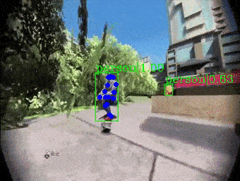

## Getting Started

**Clone** mmskeleton from github:

``` shell
git clone https://github.com/open-mmlab/mmskeleton.git
cd mmskeleton
```

**Install** the mmskeleton:
``` shell
python setup.py develop
```

To **verify** that mmskeleton installed correctly, use:
```shell
python mmskl.py pose_demo [--gpus $GPUS]
# or "python mmskl.py pose_demo_HD [--gpus $GPUS]" for a higher accuracy
```
An generated video as below will be saved under the prompted path.

<p align="center">
    
</p>


### Basic usage:

Any application in mmskeleton is described by a configuration file. That can be started by a uniform command:
``` shell
python mmskl.py $CONFIG_FILE [--options $OPTHION]
```
which is equivalent to
```
mmskl $CONFIG_FILE [--options $OPTHION]
```
Optional arguments `options` is defined in the configuration file.
You can check them via:
``` shell
mmskl $CONFIG_FILE -h
```

### Example:

See [START_RECOGNITION.md](../doc/START_RECOGNITION.md) for learning how to train a model for skeleton-based action recognitoin.
